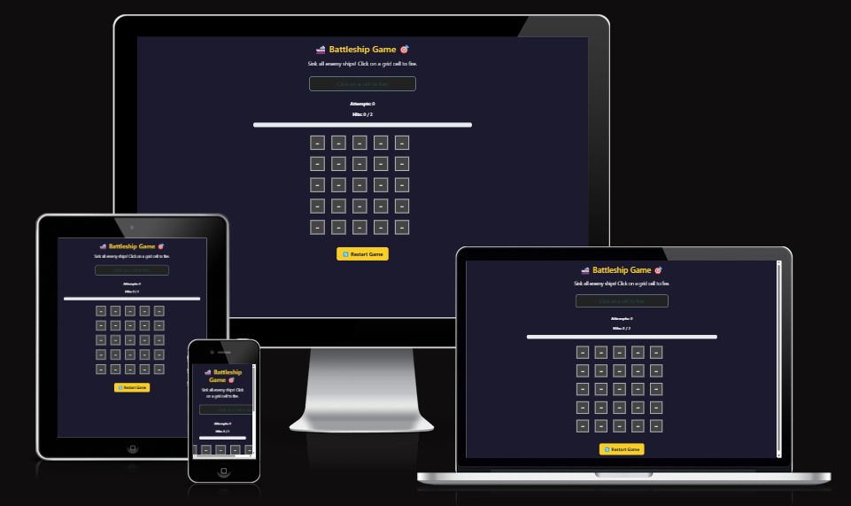
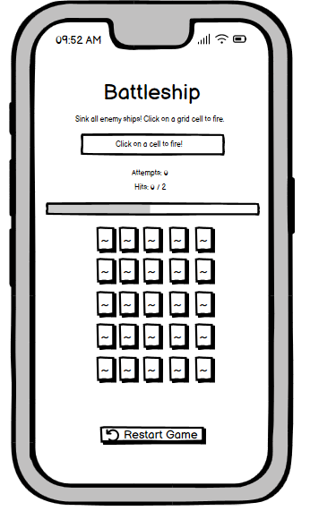
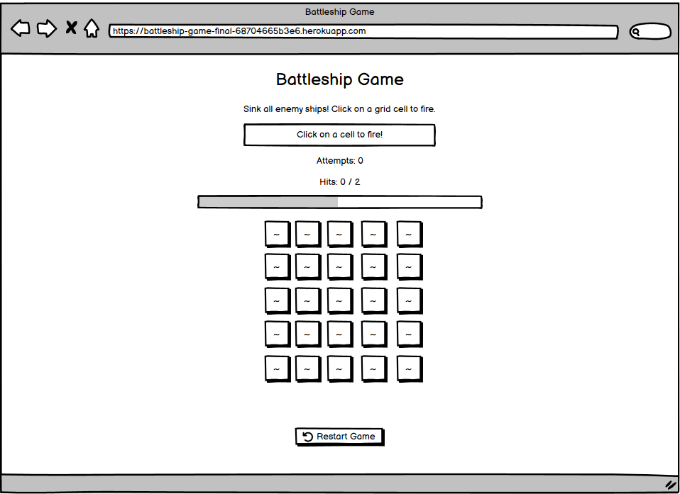

# 🚢 Battleship Game 🎯

Battleship Game is a fun and interactive single-player web-based game where players try to sink hidden enemy ships by clicking on grid cells. The goal is to locate and hit all ships before running out of attempts. 

The game features a **modern UI**, **real-time progress tracking**, and **a dynamic game status bar** that updates with every move.

🔹 **Built With:** Python (Flask), JavaScript, HTML, CSS (Bootstrap)  
🔹 **Live Demo:** [Play on Heroku](https://battleship-game-final-68704665b3e6.herokuapp.com/)  

---

## 📸 Screenshots


---

## **👤 User Stories for Battleship Game**

### **1. First-time Visitor**
- As a first-time visitor, I want to understand the game rules easily.
- As a first-time visitor, I want a visually appealing and easy-to-navigate interface.
- As a first-time visitor, I want to see feedback for my actions (hits, misses, and progress).

### **2. Returning Player**
- As a returning player, I want to play the game multiple times without reloading the page.
- As a returning player, I want to track my number of attempts.
- As a returning player, I want to see my progress towards victory.

### **3. Game Administrator (Developer)**
- As a developer, I want to ensure the game is **fully responsive**.
- As a developer, I want the game to be **error-free and user-friendly**.
- As a developer, I want to deploy and update the game **easily on Heroku**.

---

## **🎨 UX Design**

The game interface is designed to be **clean, minimalistic, and engaging**.  
Key elements include:
- **A dark theme with bright highlights** for contrast.
- **Interactive grid cells** with hover and click effects.
- **A responsive layout** to work on desktop and mobile.
- **Animated hit and miss markers** for visual feedback.

### **🔹 Color Scheme**
The colors used in the game are designed to provide clear visibility and engagement:
- `#1a1a2e` → Background color (dark navy)
- `#ffcc00` → Interactive elements (buttons, status updates)
- `#ff0000` → Hit marker (indicating a successful attack)
- `#007bff` → Miss marker (indicating a missed shot)
- `#28a745` → Progress bar (tracking successful hits)

### **🔹 Typography**
- **Montserrat** → Used for headers and status messages.
- **Lato** → Used for button text and grid numbers.

### **🔹 Wireframes**
| Page | Screenshot |
|---|---|
| Game Board (Mobile) |  |
| Game Board (Desktop) |  |

---

## **🛠 Features**

### **✅ Existing Features**
- **Grid-based Battleship Game:** Click on a grid cell to shoot.
- **Real-time Game Status:** Updates for hits, misses, and win conditions.
- **Progress Bar:** Tracks the number of successful hits.
- **End-Game Lock:** Prevents further moves after all ships are sunk.
- **Modern UI:** Clean Bootstrap design with animations.

### **🔜 Future Features**
- **AI Opponent Mode:** Play against an AI that fires back.
- **Difficulty Levels:** Adjust grid size and ship placement complexity.
- **Leaderboard:** Track scores and fastest completion times.
- **Sound Effects:** Add battle-themed sounds for hits and misses.

---

## 🌐 Deployment (Heroku via Heroku Dashboard)

You can deploy this app to Heroku using the web interface, without needing to use the CLI.

### Prerequisites

- A [Heroku account](https://heroku.com)
- A GitHub repository with your project code pushed

### Steps

1. **Log in to Heroku**  
   Go to [https://dashboard.heroku.com](https://dashboard.heroku.com) and log in to your account.

2. **Create a New App**  
   - Click the **"New"** button (top right)  
   - Select **"Create new app"**  
   - Choose a unique name and region  
   - Click **"Create app"**

3. **Connect to GitHub**  
   - Go to the **"Deploy"** tab of your new app  
   - Under **Deployment method**, select **GitHub**  
   - Click **"Connect to GitHub"**  
   - Search for your repository and click **"Connect"**

4. **Set Up Build Configuration**

   Ensure the following files are in your repo before deploying:

   - **Procfile**
     ```makefile
     web: gunicorn app:app
     ```
   - `requirements.txt` – lists dependencies  
   - `runtime.txt` *(optional)* – to specify Python version (e.g., `python-3.11.2`)

5. **Deploy the App**

   - Scroll to the **"Manual deploy"** section  
   - Select the branch (usually `main` or `master`)  
   - Click **"Deploy Branch"**  
   - Wait for the build to complete — Heroku will handle installing dependencies and starting the app

6. **Launch the App**

   - Once deployed, click the **"Open app"** button at the top right  
   - Your app is now live!

### 🔁 Optional: Enable Automatic Deploys

You can also enable **Automatic Deploys** so that every push to GitHub triggers a new deployment.

---

## 🎮 How to Play

1. **Click any cell** in the grid to fire at that location.
2. A **hit** will display a red **❌**, while a **miss** will show a blue **⭕**.
3. Your number of **hits** and **total attempts** will update in real-time.
4. A **progress bar** tracks how close you are to sinking all ships.
5. Once all ships are hit:
   - A **victory message** will appear.
   - The game board will be disabled.
6. Click the **Restart** button to play again without refreshing the page.

---

## 🧪 Testing

Manual testing was carried out throughout the development process to ensure functionality, responsiveness, and a smooth user experience.

### ✅ Features Tested

- **Grid Rendering:**  
  - Game grid loads correctly on all screen sizes (desktop, tablet, mobile).
  
- **Game Interactions:**  
  - Hits and misses register correctly.  
  - Red ❌ appears for hits; blue ⭕ appears for misses.  
  - Duplicate shots on the same cell are blocked and trigger a warning.

- **Game State Management:**  
  - Hit counter and total attempts update in real-time.  
  - Progress bar accurately reflects the percentage of ships hit.  
  - Victory message appears when all ships are sunk.  
  - Game board disables after winning.  
  - Restart button resets the game without refreshing the page.

### 🖥️ Browser Compatibility

Tested successfully on the latest versions of:

- Chrome
- Firefox
- Safari
- Microsoft Edge

### 📱 Responsive Design

Tested across various devices and screen sizes using:

- Chrome DevTools
- Physical mobile devices (iOS and Android)

### 📄 Additional Testing Details

Refer to [`TESTING.md`](TESTING.md) for a full breakdown of test cases, results, and known issues (if any).

---

## 🧰 Tools & Technologies

The following tools and technologies were used in the development and deployment of this project:

### 🖥️ Development

- **Python 3** – Core programming language
- **Flask** – Lightweight web framework for Python
- **HTML5** – Markup language for structuring the web pages
- **CSS3** – Styling and layout of the interface
- **Bootstrap 5** – Responsive design framework for styling
- **JavaScript (ES6)** – Game logic and interactivity on the frontend

### 🚀 Deployment

- **Gunicorn** – WSGI HTTP server for running Flask apps in production
- **Heroku** – Cloud platform for hosting and deployment
- **Git & GitHub** – Version control and collaboration

These tools collectively power the game’s backend logic, frontend user experience, and seamless deployment.

---

## 🙏 Credits

### 📚 Code & Design Resources

- [Bootstrap](https://getbootstrap.com/) – Frontend framework used for styling and responsive layout  
- [Flask Documentation](https://flask.palletsprojects.com/) – Official reference for backend development  
- [MDN Web Docs](https://developer.mozilla.org/) – Comprehensive reference for JavaScript, CSS, and HTML  

### 💬 Special Thanks

- **Code Institute Community** – For continuous feedback, peer support, and shared knowledge  
- **Mentor & Reviewers** – For invaluable guidance, constructive suggestions, and helping refine the project  