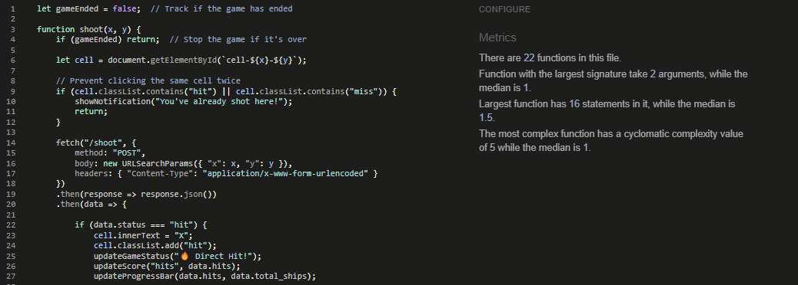
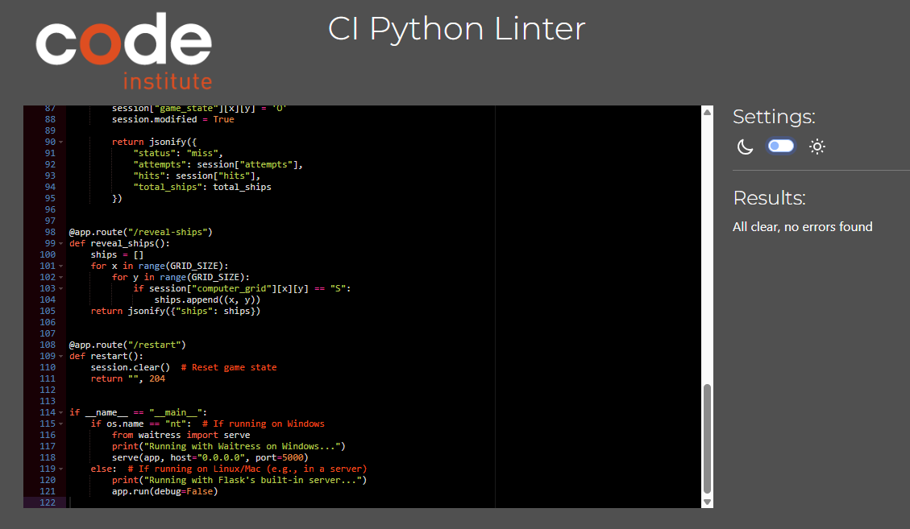
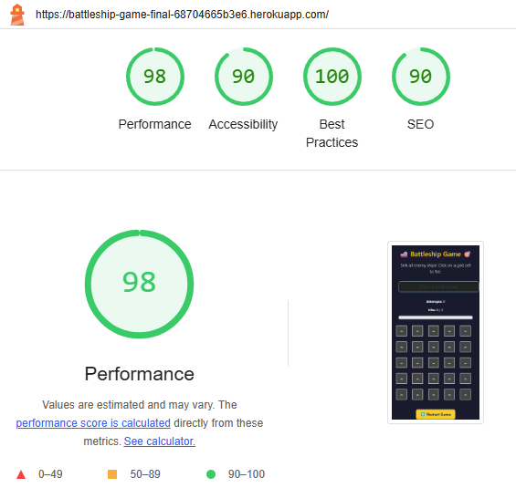
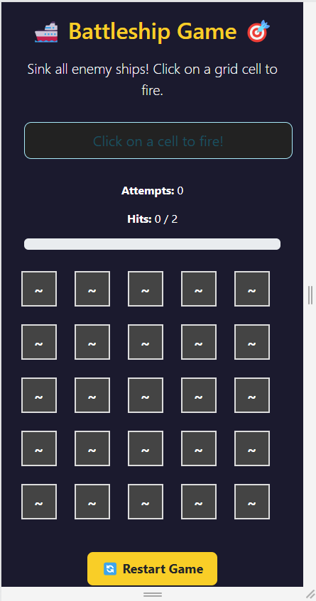
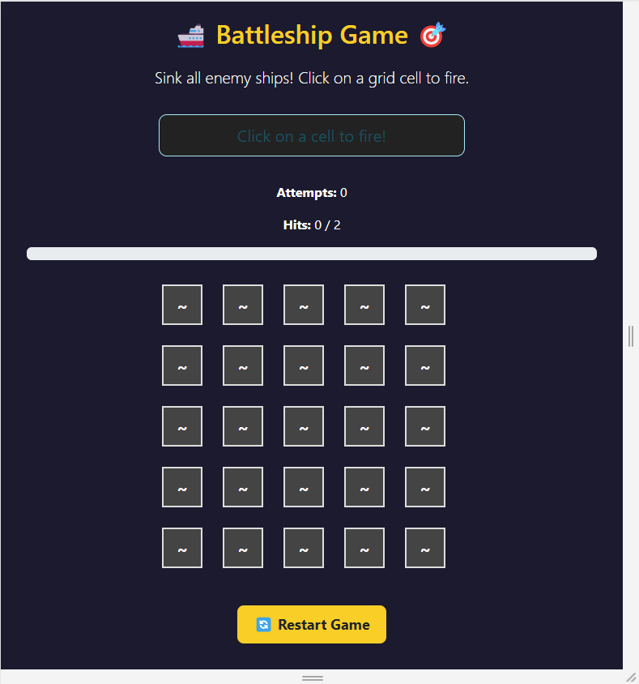
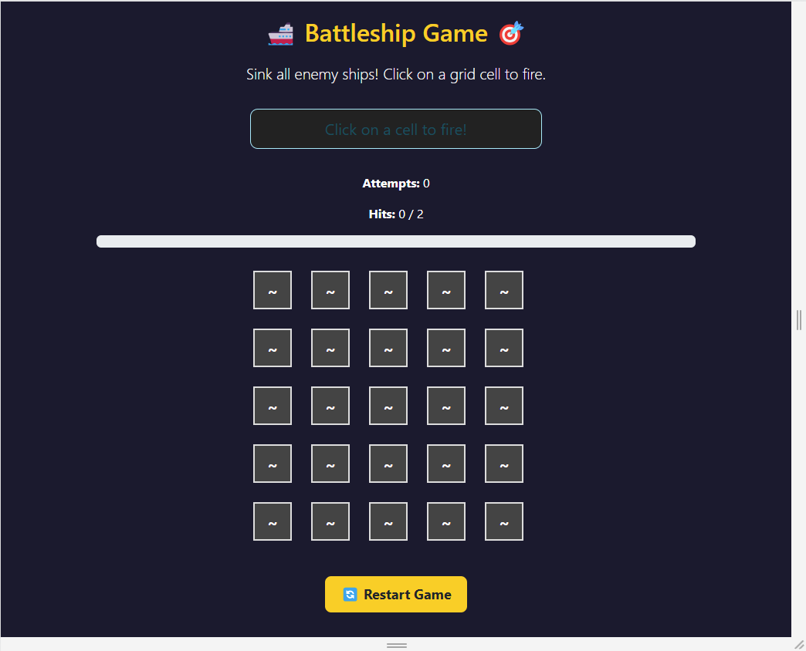

## Code Validation

### HTML

I have used the recommended [HTML W3C Validator](https://validator.w3.org) to validate all of my HTML files.

#### Initial

---

| Page | Screenshot | Notes |
| --- | --- | --- |
| index.html |  | Bad value for CSS href attribute. Fix: replace with appropriate URL for HTML validation but required for flask|
| index.html |  | Bad value for JavaScript href attribute. Fix: replace with appropriate URL for HTML validation but required for flask|
| index.html |  | Bad value for attribute aria-valuemax. Fix: replaced with aria-valuemax="2" for purpose of static validation put set back for flask to run correctly |
| index.html |  | Bad value for attribute id. Fix: Replace with 

 for static validation but removed for final deploy version. |
| index.html |  | Stray end tag. Fix: remove stray tag and re-align. |

- Majority of this issue arose from use of jinja2 templating while not being rendered through Flask. These templates were removed for static validation and replaced prior to deployment.

#### Final State 

---

| Page | Screenshot | Notes |
| --- | --- | --- |
| index.html |  | Pass: No Errors |

---

### CSS

I have used the recommended [CSS Jigsaw Validator](https://jigsaw.w3.org/css-validator/) to validate the CSS file for this project.

| Page | Screenshot | Notes |
| --- | --- | --- |
| style.css |  | Pass: No Errors |

---

### JavaScript

I have used [JS Hint](https://jshint.com/) to validate the JavaScript file for this project.

| Page | Screenshot | Notes |
| --- | --- | --- |
| script.js |  | Pass: No Errors |

---

### Python

I have used [Code Institute PEP8](https://pep8ci.herokuapp.com/) linter to validate the python file for this project.

| Page | Screenshot | Notes |
| --- | --- | --- |
| app.py |  | Pass: No Errors |

---

## Lighthouse Audit

I've tested my deployed project using the Lighthouse Audit tool to check for any major issues.

| Page | Size | Screenshot | Notes |
| --- | --- | --- | --- |
| UI | Mobile |  | Minor render-blocking and text compression suggestions |
| UI | Desktop |  | Minor render-blocking and text compression suggestions |

---

## Responsiveness

I've tested my deployed project on multiple devices to check for responsiveness issues.

| Device | Screenshot | Notes |
| --- | --- | --- |
| Mobile (DevTools) |  | Works correctly |
| Tablet (DevTools) |  | Works correctly  |
| Laptop & Desktop (DevTools) |  | Works correctly |

---