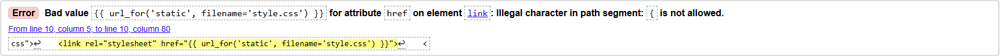
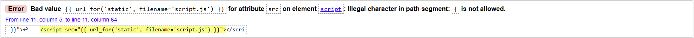
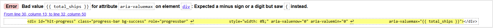
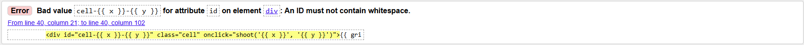
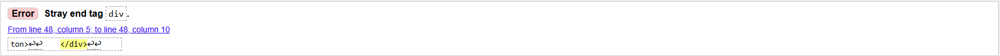
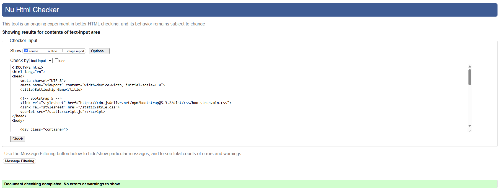
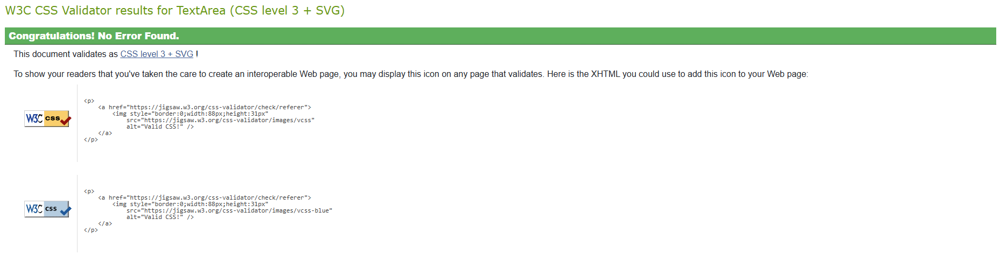

## Code Validation

### HTML

I have used the recommended [HTML W3C Validator](https://validator.w3.org) to validate all of my HTML files.

#### Initial

---

| Page | Screenshot | Notes |
| --- | --- | --- |
| UI |  | Bad value for CSS href attribute. Fix: replace with appropriate URL for HTML validation but required for flask|
| UI |  | Bad value for JavaScript href attribute. Fix: replace with appropriate URL for HTML validation but required for flask|
| UI |  | Bad value for attribute aria-valuemax. Fix: replaced with aria-valuemax="2" for purpose of static validation put set back for flask to run correctly |
| UI |  | Bad value for attribute id. Fix: Replace with 

 for static validation but removed for final deploy version. |
| UI |  | Stray end tag. Fix: remove stray tag and re-align. |

- Majority of this issue arose from use of jinja2 templating while not being rendered through Flask. These templates were removed for static validation and replaced prior to deployment.

#### Final State 

---

| Page | Screenshot | Notes |
| --- | --- | --- |
| Home |  | Pass: No Errors |

### CSS

I have used the recommended [CSS Jigsaw Validator](https://jigsaw.w3.org/css-validator/) to validate the CSS file for this project.

| Page | Screenshot | Notes |
| --- | --- | --- |
| style.css |  | Pass: No Errors |